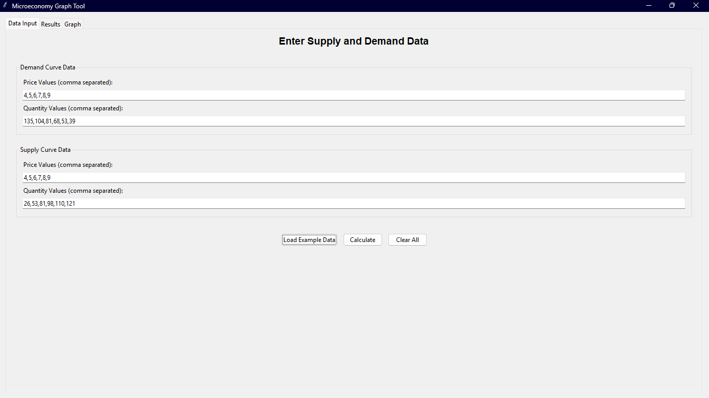

# Microeconomic Graphing Tool

🗪 README.md en español: [README_ES.md](README_ES.md)

A Python-based tool for microeconomic analysis that calculates and visualizes supply and demand curves, market equilibrium, and economic surpluses with a graphical user interface.

## 🎯 Key Features

### Mathematical Functions

* **Linear Regression**: Implements the least squares method to compute regression coefficients
* **Equilibrium Calculation**: Determines market equilibrium price and quantity
* **Surplus Computation**: Calculates consumer and producer surpluses

### User Interface

* **Tabbed Interface**: Three main tabs for data input, results, and graphing
* **Data Entry**: Easy input of supply and demand data with validation
* **Result Visualization**: Clear display of all computed parameters
* **Interactive Graphs**: Visual representation of supply and demand curves
* **Export Functionality**: Save results to CSV and graphs as images
* **CSV Data Loading**: Load example data from CSV file

### Data Input Options

1. **Custom Data**: Manually input your own price and quantity data for analysis
2. **Example Data**: Load predefined data from a CSV file
3. **Reset Function**: Clear all input fields

## 📁 File Structure

* `main.py`: Main application with modular GUI
* `funct.py`: Mathematical functions and graphing utilities
* `example_data.csv`: Sample dataset for supply and demand curves
* `requirements.txt`: Python dependencies

## 📦 Dependencies

* **matplotlib**: For graph visualization
* **numpy**: For mathematical operations
* **pandas**: For CSV data handling
* **tkinter**: For GUI (included with Python)

## 🚀 Installation

1. Clone the repository
2. Install dependencies:

   ```bash
   pip install -r requirements.txt
   ```
3. Run the application:

   ```bash
   python main.py
   ```

## 📖 Usage

### GUI Application

1. Run `python main.py`
2. Enter supply and demand data in the "Data Input" tab
3. Click "Load Example Data" to import sample CSV data
4. Click "Calculate" to process the data
5. View the results in the "Results" tab
6. View the graph in the "Graph" tab
7. Export results to CSV or save the graph

### User Interface

#### Data Input Tab



The data input tab allows easy and intuitive entry of supply and demand information. You can load example data or manually enter your own values.

#### Results Tab


This tab displays all computed results, including curve parameters, the equilibrium point, and economic surpluses.

#### Graph Tab


The graph tab shows a visual representation of the supply and demand curves, the equilibrium point, and the areas corresponding to economic surpluses.

## 🏗️ Code Architecture

The application follows a modular design with separate classes for specific responsibilities:

* **DataManager**: Handles data loading, validation, and preprocessing
* **Calculator**: Performs all mathematical computations
* **GraphManager**: Generates and renders graphs
* **ExportManager**: Handles data export functionality
* **MicroeconomyApp**: Main GUI class for the application

## 📊 CSV Data Format

The `example_data.csv` file contains supply and demand data in the following format:

```csv
curve_type,price,quantity
demand,4,135
demand,5,104
...
supply,4,26
supply,5,53
...
```

## ⚙️ Technical Implementation

* Linear regression using the least squares method
* Equilibrium calculated via curve intersection
* Surplus calculated through geometric methods
* Error handling for edge cases (parallel curves, negative values)
* Input validation to ensure data integrity
* GUI built with Tkinter
* Integrated with Matplotlib for interactive graphing
* CSV export functionality
* Modular architecture for maintainability and extension

## 🔧 Detailed Features

### Mathematical Computations

* **Linear Regression**: Computes best-fit lines for supply and demand data
* **Equilibrium Point**: Finds the intersection of supply and demand curves
* **Economic Surpluses**: Calculates both consumer and producer surplus areas

### Data Validation

* Ensures price and quantity arrays have matching lengths
* Requires a minimum of two data points per curve
* Graceful handling of invalid or extreme inputs

### Visualization

* Professional and clear graph outputs
* Markers for equilibrium point
* Reference lines for equilibrium price and quantity
* Informative legends

### Export Options

* Export calculated results to CSV
* Save graphs in multiple formats (PNG, PDF)
* Maintains high image quality for use in presentations

### Application Screenshots

The application features an intuitive interface divided into three main tabs:

**Data Input Tab**: Enables entry of supply and demand data, loading of examples from CSV, and data validation before processing.

**Results Tab**: Displays all performed mathematical computations, including curve parameters, equilibrium point, and surpluses.

**Graph Tab**: Provides a clear visualization of the supply and demand curves, with the equilibrium point marked and surplus areas highlighted.
