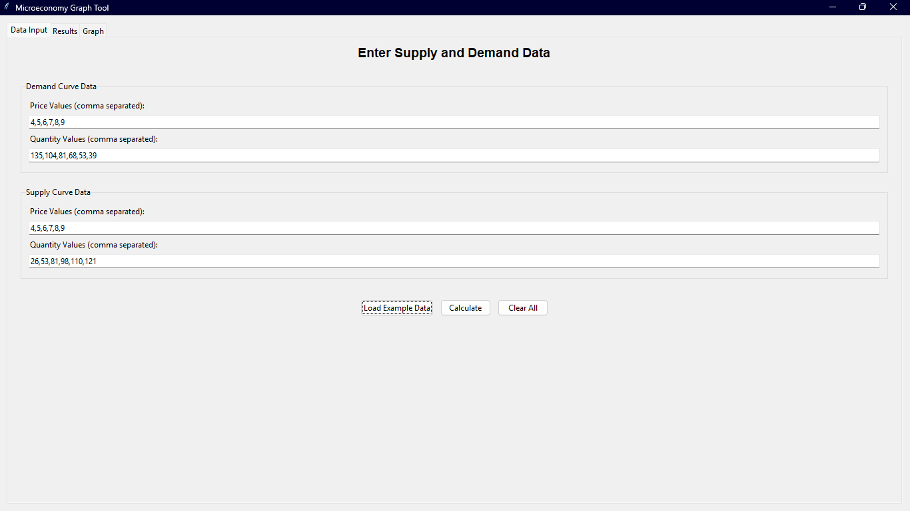
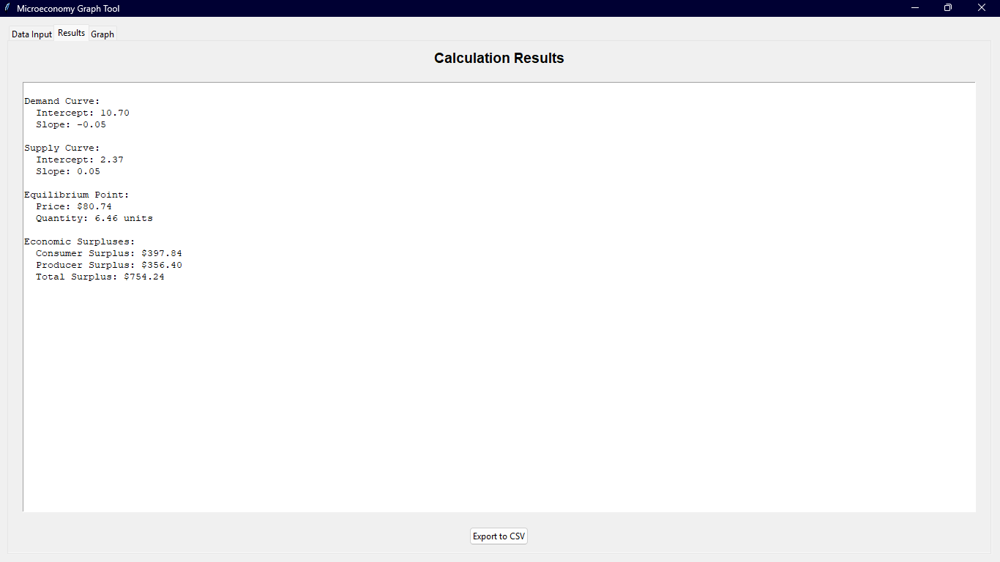
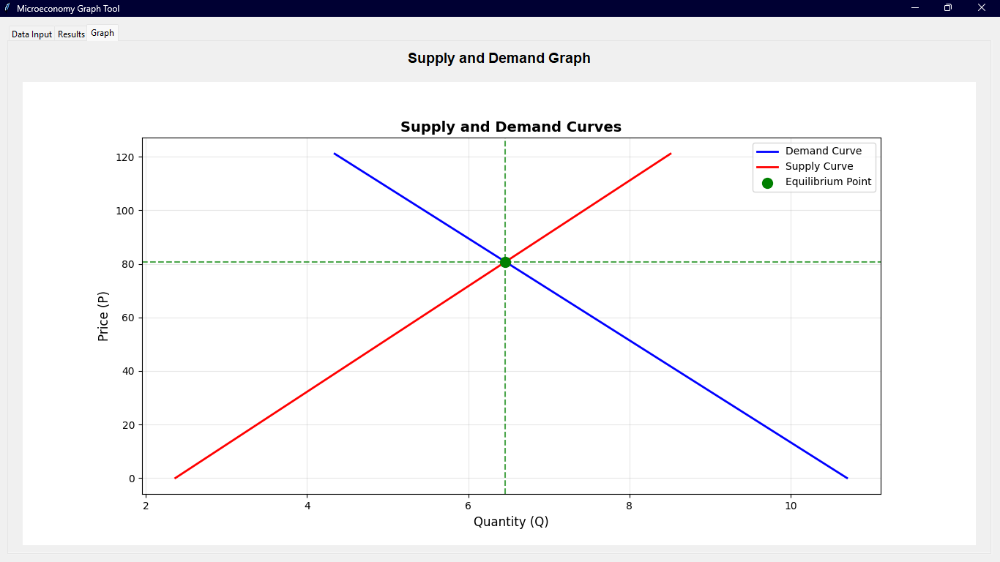

# Herramienta de Gráficos Microeconómicos

Una herramienta de Python para análisis microeconómico que calcula y visualiza curvas de oferta y demanda, puntos de equilibrio y excedentes económicos con una interfaz gráfica de usuario.

## 🎯 Características Principales

### Funciones Matemáticas
- **Regresión Lineal**: Implementa el método de mínimos cuadrados para calcular coeficientes de regresión
- **Cálculo de Equilibrio**: Determina el precio y cantidad de equilibrio del mercado
- **Cálculo de Excedentes**: Computa excedentes del consumidor y productor

### Interfaz de Usuario
- **Interfaz con Pestañas**: Tres pestañas principales para entrada de datos, resultados y gráficos
- **Entrada de Datos**: Fácil ingreso de datos de oferta y demanda con validación
- **Visualización de Resultados**: Presentación clara de todos los parámetros calculados
- **Gráficos Interactivos**: Representación visual de curvas de oferta y demanda
- **Funcionalidad de Exportación**: Guardar resultados en CSV y gráficos como imágenes
- **Carga de Datos CSV**: Cargar datos de ejemplo desde archivo CSV

### Opciones de Entrada de Datos
1. **Datos Personalizados**: Ingresa tus propios datos de precio y cantidad para análisis
2. **Datos de Ejemplo**: Cargar datos predefinidos desde archivo CSV
3. **Función de Limpieza**: Reiniciar todos los campos de entrada

## 📁 Estructura de Archivos

- `main.py`: Aplicación principal con interfaz GUI modular
- `funct.py`: Funciones matemáticas y utilidades de graficación
- `example_data.csv`: Archivo de datos de ejemplo para curvas de oferta y demanda
- `requirements.txt`: Dependencias de Python

## 📦 Dependencias

- **matplotlib**: Para visualización de gráficos
- **numpy**: Para operaciones matemáticas
- **pandas**: Para manejo de datos CSV
- **tkinter**: Para interfaz gráfica de usuario (incluido con Python)

## 🚀 Instalación

1. Clona el repositorio
2. Instala las dependencias:
   ```bash
   pip install -r requirements.txt
   ```
3. Ejecuta la aplicación:
   ```bash
   python main.py
   ```

## 📖 Uso

### Aplicación GUI
1. Ejecuta `python main.py`
2. Ingresa datos de oferta y demanda en la pestaña "Data Input"
3. Haz clic en "Load Example Data" para cargar datos desde archivo CSV
4. Haz clic en "Calculate" para procesar los datos
5. Ve los resultados en la pestaña "Results"
6. Observa el gráfico en la pestaña "Graph"
7. Exporta resultados a CSV o guarda el gráfico

### Interfaz de Usuario

#### Pestaña de Entrada de Datos


La pestaña de entrada de datos permite ingresar información de oferta y demanda de manera fácil e intuitiva. Puedes cargar datos de ejemplo o ingresar tus propios valores.

#### Pestaña de Resultados


En esta pestaña se muestran todos los cálculos realizados, incluyendo los parámetros de las curvas, el punto de equilibrio y los excedentes económicos.

#### Pestaña de Gráfico


La pestaña de gráfico muestra la representación visual de las curvas de oferta y demanda, el punto de equilibrio y las áreas de excedentes económicos.


## 🏗️ Arquitectura del Código

La aplicación sigue un diseño modular con clases separadas para diferentes responsabilidades:

- **DataManager**: Maneja carga, análisis y validación de datos
- **Calculator**: Realiza todos los cálculos matemáticos
- **GraphManager**: Crea y muestra gráficos
- **ExportManager**: Maneja funcionalidad de exportación de datos
- **MicroeconomyApp**: Clase principal de la aplicación con GUI

## 📊 Formato de Datos CSV

El archivo `example_data.csv` contiene datos de oferta y demanda en el siguiente formato:
```csv
curve_type,price,quantity
demand,4,135
demand,5,104
...
supply,4,26
supply,5,53
...
```

## ⚙️ Implementación Técnica

- Regresión lineal usando método de mínimos cuadrados
- Cálculo de equilibrio a través de intersección de curvas
- Cálculo de excedentes usando métodos geométricos
- Manejo de errores para casos extremos (curvas paralelas, valores negativos)
- Validación de entrada para integridad de datos
- Interfaz gráfica basada en Tkinter
- Integración con Matplotlib para gráficos interactivos
- Funcionalidad de exportación CSV
- Arquitectura de código modular para mantenibilidad

## 🔧 Funcionalidades Detalladas

### Cálculos Matemáticos
- **Regresión Lineal**: Calcula la línea de mejor ajuste para datos de oferta y demanda
- **Punto de Equilibrio**: Encuentra donde se intersectan las curvas de oferta y demanda
- **Excedentes Económicos**: Calcula el excedente del consumidor y productor

### Validación de Datos
- Verifica que los arrays de precio y cantidad tengan la misma longitud
- Requiere al menos 2 puntos de datos para cada curva
- Maneja errores de entrada de datos de manera elegante

### Visualización
- Gráficos claros y profesionales
- Marcadores para puntos de equilibrio
- Líneas de referencia para precio y cantidad de equilibrio
- Leyendas informativas

### Exportación
- Exporta resultados calculados a formato CSV
- Guarda gráficos en múltiples formatos (PNG, PDF)
- Mantiene la calidad de imagen para presentaciones

### Capturas de Pantalla de la Aplicación

La aplicación cuenta con una interfaz intuitiva dividida en tres pestañas principales:

**Pestaña de Entrada de Datos**: Permite ingresar datos de oferta y demanda, cargar ejemplos desde CSV y validar la información antes de procesarla.

**Pestaña de Resultados**: Muestra todos los cálculos matemáticos realizados, incluyendo parámetros de curvas, punto de equilibrio y excedentes económicos.

**Pestaña de Gráfico**: Proporciona una visualización clara de las curvas de oferta y demanda con el punto de equilibrio marcado y las áreas de excedentes identificadas.
